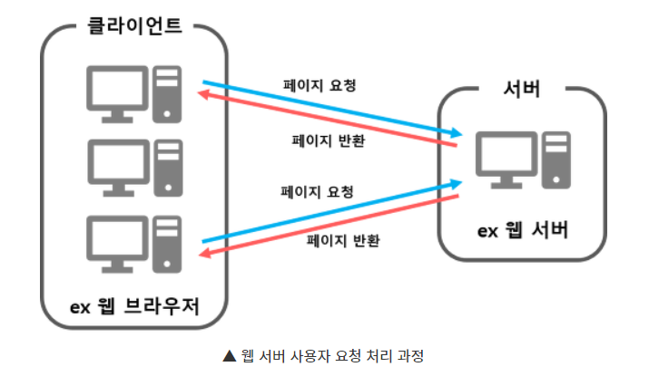

<h3>
1. SSO란 무엇인가?
</h3>
여러 개의 사이트에서 한번의 로그인으로 여러가지 다른 사이트들을 자동적으로 접속하여 이용하는 방법을 말한다.
 
하나의 사용자 정보를 기반으로 여러 시스템을 하나의 통합 인증을 사용하게 하는 것을 말한다.
<h3>
2. SSO의 구성 요소
</h3>
(1) 사용자 통합 로그인 (2) 인증 서버 (3) 통합 에이전트 : 각 정보 시스템에 대한 정보 관리 
(4)LDAP(Lightweight Directory Access Protocol) : 네트워크 상의 자원을 식별하고 인가된 사용자만 접근하도록 하는 네트워크 디렉토리 서비스
<h3>
3. SSO의 기술 요소
</h3>
- 인증 : PKI(Public Key Infra structure), 생체 인식, OTP(One Time Password) 
- 관리 : LDAP(Lightweight Directory Access Protocol), 쿠키(Cookie) 
- 암호화 통신 : SSL(Secure Socket Layer), IPSec(IP Security Protocol)  

<h3>
4. SSO의 구축 유형
</h3>

<h4>
1) 인증 대행 모델(Delegation)
</h4>

