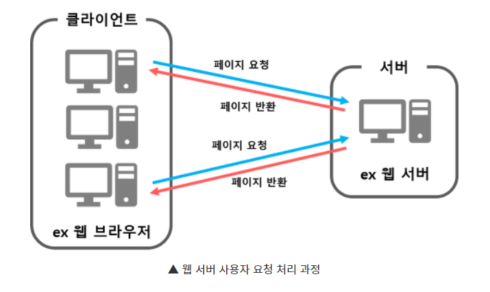

## # 웹 서버 (Web Server)
- 사전적 정의 : 웹 브라우저 클라이언트로부터 HTTP 요청을 받아들이고 HTML 문서와 같은 웹 페이지를 반환하는 컴퓨터 프로그램
- 클라이언트가 웹 브라우저에서 어떠한 페이지 요청을 하면 웹 서버에서 그 요청을 받아 **정적 컨텐츠를 제공하는 서버**
  - 정적 컨텐츠 : 단순 HTML 문서, CSS, Javascript, 이미지, 파일 등 즉시 응답가능한 컨텐츠
- 웹 서버가 동적 컨텐츠를 요청 받으면 WAS에게 해당 요청을 넘겨주고, WAS에서 처리한 결과를 클라이언트에게 전달해주는 역할

